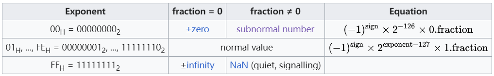
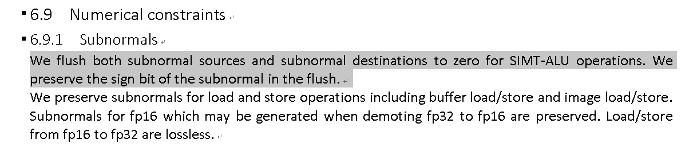

- [1. Summary](#1-summary)
- [2. FP32 基本概念](#2-fp32-基本概念)
- [3. subnormal 的处理](#3-subnormal-的处理)
  - [3.1. Background](#31-background)
  - [3.2. Biren 的处理](#32-biren-的处理)
- [4. 验证](#4-验证)
  - [4.1. cuda](#41-cuda)
  - [4.2. supa](#42-supa)
  - [4.3. Summary](#43-summary)

## 1. Summary

我们要解答一下问题：
- [x] float 浮点数在计算机中是如何表达的，以及简要说明为什么如此表述
- [x] 有哪些特殊浮点数，正负0，正负无穷大，NaN
- [x] subnormal number 是什么
- [x] 英伟达 GPU 是如何处理 subnormal number 的：结果正确
- [ ] 英伟达 GPU 内部是硬件支持还是软件实现的 subnormal number 计算
- [ ] 什么情况下出现 subnormal number

## 2. FP32 基本概念



E 全0 和全1是非 normal 的，最小的

最小的 normal 正数： $2^{-126}\approx 1.18\times 10^{-38}$，此时 E=1，fraction=0

最小的 subnormal 正数 (也是最小的正数)： $2^{-149}\approx 1.4\times 10^{-45}$，149 是 -126 + (-23) 来的

最大的 subnormal 正数不超过最小的 normal 即 $1.18 \times 10^{-38}$


## 3. subnormal 的处理

### 3.1. Background

> Subnormal numbers provide the guarantee that addition and subtraction of floating-point numbers never underflows; two nearby floating-point numbers always have a representable non-zero difference. Without gradual underflow, the subtraction a − b can underflow and produce zero even though the values are not equal. This can, in turn, lead to division by zero errors that cannot occur when gradual underflow is used.[1]
> 
> Subnormal numbers were implemented in the Intel 8087 while the IEEE 754 standard was being written. They were by far the most controversial feature in the K-C-S format proposal that was eventually adopted,[2] but this implementation demonstrated that subnormal numbers could be supported in a practical implementation. Some implementations of floating-point units do not directly support subnormal numbers in hardware, but rather trap to some kind of software support. While this may be transparent to the user, it can result in calculations that produce or consume subnormal numbers being much slower than similar calculations on normal numbers.

很多硬件并不支持处理 subnormal number 的计算，我们的也是。可以用软件实现，但是成本相对较高，一般会是 normal number 的处理的 6 倍耗时。

### 3.2. Biren 的处理

我们的芯片做 SIMT-ALU 时会把 subnormal number flush 成 0，而对于 load store 操作时则不会。



## 4. 验证

### 4.1. cuda

```bash
a = 1.401298e-45
b = 1.401298e-45
sum = 2.802597e-45
```

### 4.2. supa

符合预期，的确不支持 subnorm 计算，会被 flush 成 0.

```bash
a = 1.401298e-45
b = 1.401298e-45
sum = 0.000000e+00
```

### 4.3. Summary

cuda 结果是对的，不过不确定是否硬件实现。supa 结果是不对的。
